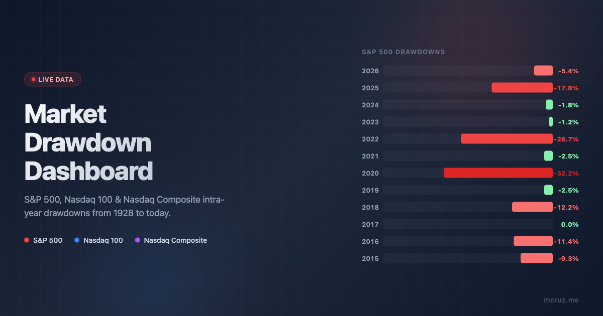

# Market Drawdown Dashboard

**Live:** [mcruz.me/market-drawdown-dashboard](https://mcruz.me/market-drawdown-dashboard/)



A single-page dashboard showing live drawdowns from all-time highs for the S&P 500, Nasdaq 100, and Nasdaq Composite, alongside a historical intra-year drawdown table going back to 1928.

## Features

- **Live prices** — fetched from Yahoo Finance via a GitHub Actions workflow every 5 minutes during market hours
- **Adaptive refresh** — polls every 60s when the market is open, slows to every 5 min when closed
- **Historical comparison** — intra-year drawdown data for S&P 500 (1928+), Nasdaq 100 (1985+), and Nasdaq Composite (1971+)
- **Drawdown severity color coding** — cells colored by severity (mild/moderate/high/severe)
- **Graceful fallback** — shows historical data if the live feed is unavailable

## How It Works

```
Yahoo Finance API
       │
       ▼
GitHub Actions (fetch-quotes.yml)  ──▶  data/live.json  ──▶  GitHub Pages
       │                                                         │
       ▼                                                         ▼
Watchdog (watchdog.yml)                                   index.html (client)
re-triggers fetch if stale                                fetches live.json
```

1. **`fetch-quotes.yml`** runs every 5 min during market hours, fetches quotes from Yahoo Finance, and commits `data/live.json`
2. **`watchdog.yml`** runs every 30 min (offset) and re-triggers the fetch workflow if data is stale — a safety net for GitHub Actions' unreliable cron scheduler
3. **`index.html`** loads on GitHub Pages, fetches `live.json`, and renders the dashboard

## Data Sources

| Index | Symbol | History |
|-------|--------|---------|
| S&P 500 | `^GSPC` | 1928–present |
| Nasdaq 100 | `^NDX` | 1985–present |
| Nasdaq Composite | `^IXIC` | 1971–present |

All data sourced from Yahoo Finance.

## Regenerating Historical Data

```bash
python scripts/generate_drawdown_data.py
```

Downloads daily prices, calculates intra-year drawdowns for all three indices, and writes JSON files to `data/`.

## Project Structure

```
├── index.html                          # The dashboard (deployed to GitHub Pages)
├── data/
│   ├── live.json                       # Live quotes (auto-updated by GitHub Actions)
│   ├── sp500_drawdowns.json            # Historical S&P 500 drawdowns
│   ├── ndx_drawdowns.json              # Historical Nasdaq 100 drawdowns
│   └── ixic_drawdowns.json             # Historical Nasdaq Composite drawdowns
├── scripts/
│   ├── generate_drawdown_data.py       # Historical data generation
│   └── fetch_live_quotes.py            # Live quote fetcher (used by GitHub Actions)
└── .github/workflows/
    ├── fetch-quotes.yml                # Scheduled quote fetching
    └── watchdog.yml                    # Staleness watchdog
```

## License

MIT
